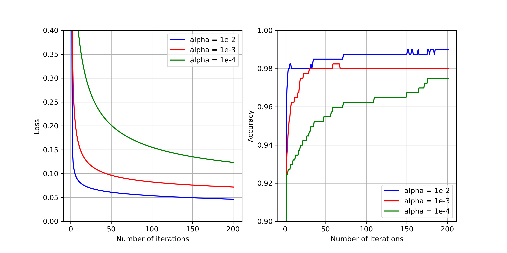
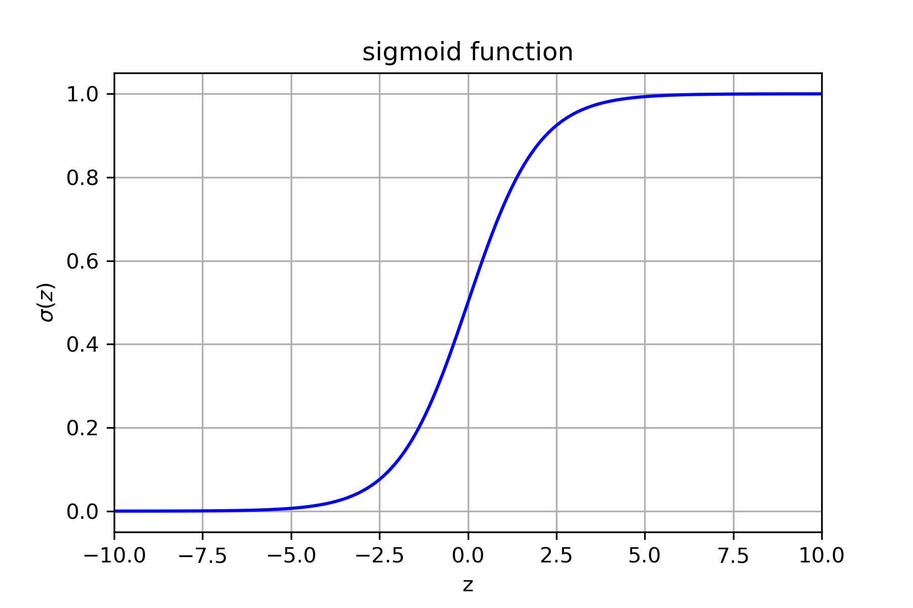

#! https://zhuanlan.zhihu.com/p/130209974


# 逻辑回归简介及实现

## 1.逻辑回归简介

### 1.1定义

​		逻辑回归（Logistic regression）是机器学习领域最为常见的模型方法之一，常常用于作为处理各种任务的基准模型（baseline）。当然各类任务往往最后所用模型的性能远超过逻辑回归方法，但是其模型结构的复杂度和训练时间也往往超过逻辑回归方法。

​		我们知道线性回归方法是用来分析自变量和因变量之间的线性关系的，其形式可以如下表示：

$$
\hat{y}=w^{T}x+b,
\tag{1.1}
$$
其中$\hat{y}$是要预测的因变量，$x$是输入的自变量，$w$和$b$则分别代表特征的权重和偏置项。线性回归方法对于那些输出变量范围为实数空间的问题较为适用，比如预测明天天气温度的大小，温度的范围正是属于实数空间的。但对于类似预测明天是否下雨这样的分类问题，预测的结果必然是要么下雨，要么不下雨两种，较于线性回归方法，逻辑回归方法会更加适合。尽管逻辑回归从名字上听起来像是预测回归问题的方法，但其实是一个分类方法。

​		逻辑回归之所以比线性回归更加适合分类问题，是因为逻辑回归在线性回归的基础上，将输出值$w^{T}+b$通过sigmoid激活函数映射到$[0,1]$的区间。sigmoid函数的数学形式为：
$$
\sigma(z)=\frac{1}{1+e^{-z}},
\tag{1.2}
$$
对应的几何图像为：



如上图所示，sigmoid函数将属于原本属于实数范围的输入$z$映射到$[0,1]$之间。并且对于$Y\in\{0,1\}$的二分类问题而言，逻辑回归的条件概率分布$P(Y|X)$可以写为：
$$
P(Y=1|x)=\frac{1}{1+e^{-(w^{T}x+b)}},
\tag{1.3}
$$

$$
P(Y=0|x)=\frac{e^{-(w^{T}x+b)}}{1+e^{-(w^{T}x+b)}}.
\tag{1.4}
$$

​		为简便记，将$w=(w^{1},w^{2},\cdots,w^{n})^{T}$扩写为$w=(w^{1},w^{2},\cdots,w^{n},b)^{T}$，其中$w^{j}$代表的是第$j$项特征的权重。将$x=(x^{1},x^{2},\cdots,x^{n})^{T}$扩写为$x=(x^{1},x^{2},\cdots,x^{n},1)^{T}$，其中$x^{j}$代表的是样本$x$第$j$项的特征值。由此，条件概率分布$P(Y|X)$可以写为：
$$
P(Y=1|x)=\frac{1}{1+e^{-w^{T}x}},
\tag{1.5}
$$

$$
P(Y=0|x)=\frac{e^{-w^{T}x}}{1+e^{-w^{T}x}}.
\tag{1.6}
$$

​		对于二分类问题来说，满足$P(Y=1|x)+P(Y=0|x)=1$，逻辑回归在判断样本$x$类别时，会根据两个类别概率值大小将样本$x$归为概率值较大的那一类。我们将条件概率分布$P(Y|X)$总结如下：
$$
P(Y|x)=P(Y=1|x)^{y}P(Y=0|x)^{1-y}.
\tag{1.7}
$$
​		对给定训练集$T=\{(x_{1},y_{1}),(x_{2},y_{2}),\cdots,(x_{N},y_{N})\}$，其似然函数写为：
$$
\prod^{N}_{i=1}P(Y=1|x_{i})^{y_{i}}P(Y=0|x_{i})^{1-y_{i}},
\tag{1.8}
$$
将公式$(1.5)$和公式$(1.6)$代入公式$(1.8)$可得：
$$
\prod^{N}_{i=1}(\frac{1}{1+e^{-w^{T}x_{i}}})^{y_{i}}(\frac{e^{-w^{T}x_{i}}}{1+e^{-w^{T}x_{i}}})^{1-y_{i}},
\tag{1.9}
$$
其对数似然函数写为：
$$
\begin{align}
  L(w)&=\sum^{N}_{i=1}[y_{i}log(\frac{1}{1+e^{-w^{T}x_{i}}})+(1-y_{i})log(\frac{e^{-w^{T}x_{i}}}{1+e^{-w^{T}x_{i}}})]\\
  &= \sum^{N}_{i=1}[y_{i}(w^{T}x_{i})-log(1+e^{w^{T}{x_{i}}})]
\end{align}.
\tag{1.10}
$$
### 1.2目标函数		

​		应用极大似然估计法需要对$L(w)$求极大值，进而得到$w$的估计值。但在求解问题时我们习惯追求损失函数或代价函数（Loss function or Cost function）的最小值，根据对数似然函数$(1.10)$，我们将逻辑回归问题的损失函数写为如下形式：
$$
J(w)=-\frac{1}{N} \sum^{N}_{i=1}[y_{i}(w^{T}x_{i})-log(1+e^{w^{T}{x_{i}}})].
\tag{1.11}
$$
​		为了估计$w$的值，对$L(w)$进行极大化，也就是对$J(w)$极小化：
$$
\hat{w}=\mathop{\arg\min}_{w}-\frac{1}{N}\sum^{N}_{i=1}[y_{i}(w^{T}x_{i})-log(1+e^{w^{T}{x_{i}}})].
\tag{1.12}
$$

### 1.3更新过程

​		因为需要找到一个$\hat{w}$使得似然函数$L(w)$极大化，也就是使$J(w)$最小化，所以需要不断的调整$\hat{w}$每项的值让损失函数的值越来越小。为此，我们对损失函数$J(w)$求每项参数的偏导数，进而让每项参数按照梯度下降（Gradient descent）的方向进行调整：
$$
\begin{align}
\frac{\partial J(w)}{\partial w_{j}}&=-\frac{1}{N} \sum^{N}_{i=1}\frac{\partial [y_{i}(w^{T}x_{i})-log(1+e^{w^{T}{x_{i}}})]}{\partial w_{j}}\\
&=-\frac{1}{N} \sum^{N}_{i=1}[\frac{\partial y_{i}(w^{T}x_{i})}{\partial w_{j}}-\frac{\partial log(1+e^{w^{T}x_{i}})}{\partial w_{j}}]\\
&=-\frac{1}{N} \sum^{N}_{i=1}[y_{i}x_{i}^{j}-\frac{\partial log(1+e^{w^{T}x_{i}})}{\partial w_{j}}]\\
&=-\frac{1}{N} \sum^{N}_{i=1}[y_{i}x_{i}^{j}-\frac{1}{1+e^{w^{T}x_{i}}}\frac{\partial(1+e^{w^{T}x_{i}})}{\partial w_{j}}]\\
&=-\frac{1}{N} \sum^{N}_{i=1}[y_{i}x_{i}^{j}-\frac{1}{1+e^{w^{T}x_{i}}}\cdot e^{w^{T}x_{i}}\cdot x_{i}^{j}]\\
&=\frac{1}{N}\sum^{N}_{i=1}[(\frac{1}{1+e^{-w^{T}x_{i}}}-y_{i})x_{i}^{j}]
\end{align}.
\tag{1.13}
$$
因此对每项参数而言，其更新方式为：
$$
\hat{w}_{j}^{k+1}=\hat{w}_{j}^{k}-\alpha \frac{1}{N}\sum^{N}_{i=1}[(\frac{1}{1+e^{-w^{T}x_{i}}}-y_{i})x_{i}^{j}],
\tag{1.14}
$$
其中$\hat{w}^{k}_{j}$，$\hat{w}^{k+1}_{j}$分别代表参数$\hat{w}_{j}$迭代到第$k$，$k+1$次时的值，$\alpha$代表学习率（Learning rate），由于$\frac{1}{N}$是一个常数因此也可以合并到$\alpha$中。

​		按照公式$(1.14)$的梯度下降公式进行更新的方法被称为批量梯度更新（Batch gradient descent）。该方法需要计算所有样本的误差并平均，这在处理海量数据时会消耗非常多的时间，尤其是当$N$非常大的时候。此时也可以采用随机梯度下降（Stochastic gradient descent）的方式来进行更新，不同之处是在于每次随机抽取一个样本来计算偏导数进行更新：
$$
\hat{w}_{j}^{k+1}=\hat{w}_{j}^{k}-\alpha [(\frac{1}{1+e^{-w^{T}x_{i}}}-y_{i})x_{i}^{j}].
\tag{1.15}
$$

## 2.算法代码实现

​		在这一小节中，我们使用python实现一个简易版本的逻辑回归方法，即仅针对二分类数据集，并且不考虑正则化等问题。由于我们纯粹使用python实现逻辑回归算法，仅需要下面的python内置包，没有引入任何第三方包，所以在基本的python3系统环境下即可运行。

```python
import math
import random
```

​		在构造的类`lr`中，初始化参数`max_iter`和`alpha`分别代表函数训练默认的迭代次数和学习率。我们仅实现了随机梯度下降方法来更新算法，所以此处并没有参数来选择优化方法，读者感兴趣可以实现其他优化方法，并在初始化参数部分做相应的改动。

```python
class lr:
    def __init__(self, max_iter = 1000, alpha = 0.01):
        self.max_iter = max_iter
        self.alpha = alpha
```

​		在训练函数部分，特征权重`self.coef_`初始化为0. 由于`self.coef_`包含偏置项，所以对训练集`X`的每项实例`x`均在最后一列添加值为1的特征项。紧接着便使用随机梯度下降的方法`self._stochastic_gradient_descent`来训练模型。函数最后返回的`self`是为了能够实现类似`sklearn`的链式调用`clf.fit(X,y).predict(X)`.需要指出的是，在这份代码里，输入项`X,y`都是`list`类型变量。

```python
def fit(self, X, y):
  self.n_fea = len(X[0])
  self.n_ins = len(X)
  self.coef_ = [0 for _ in range(self.n_fea + 1)] 
  X = list(map(lambda x: x+[1], X)) 
  self._stochastic_gradient_descent(X, y)
  return self
```

​		下面的代码块展示了随机梯度下降函数是如何实现的。第一层循环代表的是当前执行的迭代次数，直到达到`self.max_iter`停止。第二层循环代表的是当前更新到第几个样本，由于是随机梯度下降，我们使用`random.shuffle`函数来打乱样本更新顺序。第二层循环中的代码其实是在根据公式$(1.15)$来更新参数。而变量`self.loss,self.acc`则是在记录每次迭代之后，模型在训练集上的训练损失和准确率。

```python
def _stochastic_gradient_descent(self, X, y):
  idx_lst = [i for i in range(self.n_ins)]
  self.loss = []
  self.acc = []
  self.loss.append(self._loss(X, y))
  self.acc.append(0)
  for i in range(self.max_iter):
    random.shuffle(idx_lst)
    for j in idx_lst:
      wx_iter = map(lambda x, y: x * y, self.coef_, X[j])
      wx_value = sum(list(wx_iter))
      error = self._sigmoid(wx_value) - y[j]
      gradient = list(map(lambda x: x * error * self.alpha, X[j]))
      self.coef_ = list(map(lambda x, y: x - y, self.coef_, gradient))
    self.loss.append(self._loss(X,y))
    self.acc.append(self.score(X,y))
```

​		在`main.py`文件中，我们使用`sklearn`自带的二分类数据集`breast cancer`来验证我们的代码在训练时确实有效。我们将模型的训练损失和在训练集上的准确率展示在下图中。如左子图所示，相比于学习率较小的模型，学习率较大的模型其训练损失下降的较快，同时如右子图所示，学习率较大的模型其训练集准确率在同样的迭代次数下比其他模型更高。从下图中我们还可以看出训练损失是随着模型迭代次数增加而减少的，这验证了我们模型初始化参数`self.max_iter,self.alpha`的有效性。我们还将实现的逻辑回归方法`lr`与`sklearn`中的`LogisticRegression`方法进行对比，当训练集测试集以7:3的比例划分，迭代次数均为200次时，`sklearn`在测试集上的准确率为`99.42%`，我们的代码实现`98.25%`的准确率，两者性能相差不大。


**P.S. 完整的代码参见我的github: [https://github.com/crazycharles/TheWayToCTR](https://github.com/crazycharles/TheWayToCTR).**